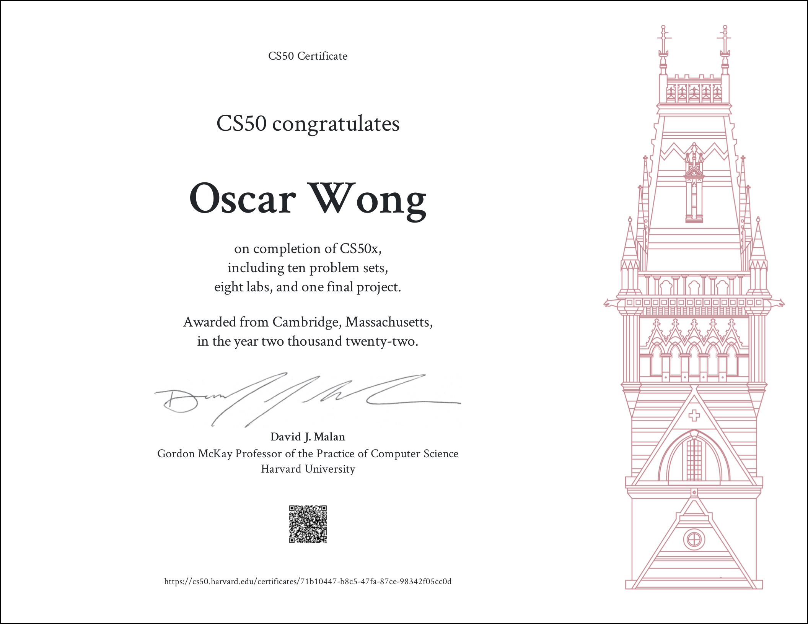

# Harvard CS 50
### Dates: December 3, 2022 to December 13, 2022

This is part of my ongoing long term plan of going through an entire core undergraduate CS curriculum using online courses. Harvard CS 50 fulfills the **Introduction to CS** requirement.

This repository contains all the code I have submitted for the course along with the final project: a simple IP Address subnet calculator I wrote in Python. Scores and comments for each week are written in ``scoreReport.txt``.

### Overall thoughts on the course
The first few labs were pretty good, but starting from lab 4 they give you too much distribution code and it takes hours to parse through what's even happening before you can start coding. It's a very exhausting process and those labs were not pleasant to go through. Other than that, the lectures were pretty good. I love the autograder they have. I enjoyed my time overall.

All code here is for reference and archival purposes. **DO NOT** submit any code here as your own.

